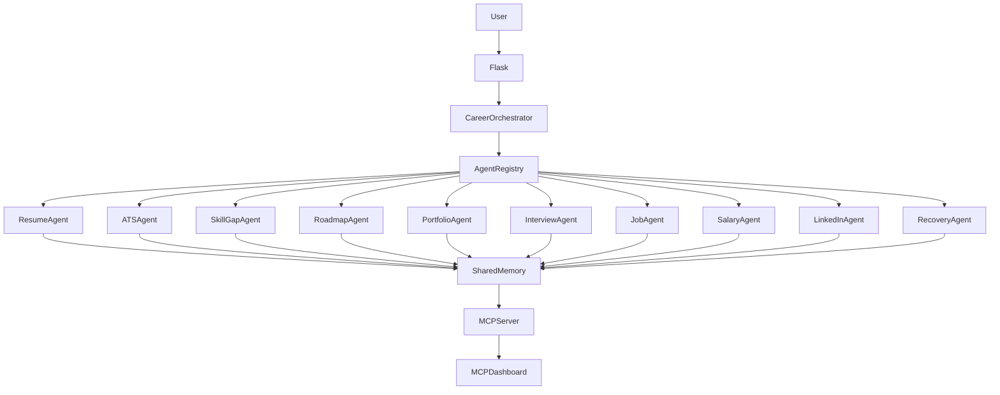

# OmniPath AI — Enterprise Career Intelligence Platform

A multi-agent AI system that guides job seekers from confusion to their dream offer — covering resumes, skills, interviews, salary negotiation, and career recovery in one centralized platform.

---

## 1. The Problem
Every year, millions of people apply to hundreds of jobs and hear nothing back. They lack feedback on whether their resume, skills, or interview techniques are failing them. Most candidates are stuck in a loop of applying and getting rejected without ever knowing why. 

While there are many isolated tools (a resume builder here, a job board there), there is no unified intelligence system that learns who you are and contextually coaches you through the entire lifecycle of a career hunt.

## 2. The Solution
**OmniPath AI** breaks that loop by providing a full-stack, AI-powered career team. It utilizes an **Enterprise Multi-Agent Architecture** consisting of 9 specialized AI agents working in tandem. 

You set up your profile once, and every agent instantly inherits your context. Agents communicate through a `SharedMemory` context, meaning the Interview Coach knows what the ATS Analyzer found in your resume, and the Career Recovery Agent can diagnose your exact points of failure.

### The Agents:
1. **Resume Optimizer & ATS Scorer**: Analyzes your resume against target roles, provides an ATS score, and rewrites bullet points.
2. **Skill Gap Analyzer**: Maps what the market expects vs. what you have, ranking what to learn next.
3. **Learning Roadmap Generator**: Generates timeline-based learning plans.
4. **Project & Portfolio Engine**: Recommends industry-grade projects and generates GitHub READMEs.
5. **Interview Coach**: A mock interview simulator scoring clarity, structure, and depth.
6. **Job Matcher**: Provides personalized job lists based on your precise background.
7. **Salary Intelligence**: Estimates market value so you never undersell yourself.
8. **LinkedIn Profile Optimizer**: Generates optimized headlines and professional summaries.
9. **Career Recovery Agent**: Diagnoses root causes of prolonged job hunting failures (e.g., resume vs. portfolio vs. interviewing) and builds a 3-phase recovery plan.

---

## 3. Architecture Overview

OmniPath AI implements a robust, production-ready Multi-Agent Orchestration pattern. 

### Key Components:
- **Career Orchestrator**: The central dispatcher. It receives tasks from Flask routes and delegates them.
- **Agent Registry**: Automatically indexes and registers all agent classes. The orchestrator requests agents exclusively through this registry.
- **Shared Memory**: A persistent context state holding session data, user profiles, individual agent outputs (resume data, job matches, skill gaps), and execution history.
- **Model Context Protocol (MCP) Server**: Exposes real-time telemetry, memory state, and execution logs to the frontend infrastructure dashboard.

### System Flow


---

## 4. Setup Instructions

The backend is a clean Python Flask app running self-contained heuristic and rule-based AI logic. No paid external API keys are required.

### Prerequisites
- Python 3.8+
- `pip` package manager

### Installation Steps

1. **Clone the repository or navigate to the project directory**:
   ```bash
   cd carrerai
   ```

2. **(Optional but recommended) Create a virtual environment**:
   ```bash
   python -m venv .venv
   # On Windows:
   .venv\Scripts\activate
   # On Mac/Linux:
   source .venv/bin/activate
   ```

3. **Install dependencies**:
   ```bash
   pip install -r requirements.txt
   ```

4. **Set your environment variables**:
   ```bash
   # Windows PowerShell
   $env:FLASK_SECRET_KEY="your-super-secret-key"
   
   # Mac/Linux
   export FLASK_SECRET_KEY="your-super-secret-key"
   ```

5. **Run the Application**:
   ```bash
   python app.py
   ```

6. **Access the App**:
   Open your browser and navigate to `http://localhost:5000`

---

## 5. Security Features

The platform is designed with enterprise security constraints in mind:
- **MIME Validation**: Strict verification that uploaded resumes are actual `application/pdf` files.
- **Payload Sanitization**: Recursive HTML escaping and sanitization of all JSON request inputs to prevent XSS.
- **Size Limiting**: Upload payloads are capped at 5MB using `MAX_CONTENT_LENGTH`.
- **Session Validation**: Secure session state validation ensuring shared memory cannot be poisoned across clients.
- **Secret Management**: Flask cryptographic keys are pulled securely from environment variables.
- **Graceful Error Handling**: Global exception handlers prevent stack trace leakage to the client.

---

## 6. MCP Hub & Telemetry

OmniPath AI features a live **Model Context Protocol (MCP) Hub** dashboard available at `/mcp-hub`. 

Instead of hiding the infrastructure, this dashboard surfaces the actual multi-agent execution pipeline in real-time. It visualizes:
- **Task Distribution**: A live chart showing which agents are processing the most tasks.
- **Execution Flow**: Animated pathways showing tasks moving from Agents to the MCP Server.
- **Central Execution Log**: Streaming console logs tracking exactly when the Orchestrator dispatches tasks and agents complete them.
- **Shared Memory Viewer**: A live JSON dump of exactly what the AI system currently knows about you.
- **System Telemetry**: Real-time tracking of memory size, total requests, and average response times.
